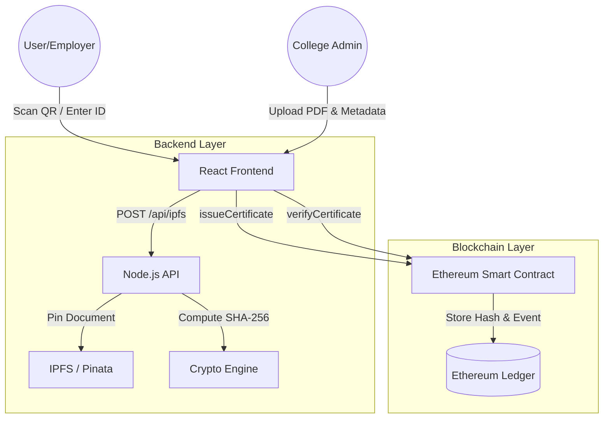

# CertChain — Blockchain-Based Academic Certificate Registry

CertChain is a decentralized platform for issuing, storing, and verifying academic credentials. By leveraging the Ethereum blockchain and IPFS, CertChain eliminates certificate forgery and streamlines the verification process for employers worldwide.

## 🚀 Problem
Each year, thousands of fake academic certificates are submitted to employers. Manual verification requires contacting institutions directly—a process that is slow, unreliable, and costly for both companies and universities.

## 💡 Solution
CertChain issues tamper-proof digital certificates whose SHA-256 hashes are permanently anchored on the Ethereum blockchain. 
- **Immutability**: Once issued, certificate data cannot be altered.
- **Instant Verification**: Employers can validate a credential in under 2 seconds by scanning a QR code or entering a Certificate ID.
- **Privacy**: Original documents are stored on IPFS, accessible only via secure hashes/CIDs.

---

## 🏗 Architecture


---

## 🛠 Tech Stack
| Layer | Technology |
| :--- | :--- |
| **Blockchain** | Solidity, Hardhat, Ethers.js (v6) |
| **Storage** | IPFS (via Pinata) |
| **Backend** | Node.js, Express, Multer |
| **Frontend** | React (Vite), Tailwind CSS, Framer Motion |
| **Security** | OpenZeppelin (AccessControl), SHA-256 |

---

## ✨ Features
1. **Admin Dashboard**: Role-based access for institutions to manage issuance and audit trails.
2. **High-Fidelity Issuance**: Professional A4 PDF generation with embedded authentication QR codes.
3. **Audit Trail**: Real-time logging of every verification attempt on-chain.
4. **Revocation Management**: Permanent, transparent invalidation of certificates for academic misconduct.
5. **Universal Scanner**: Hybrid camera/file upload scanner for instant offline-to-online verification.

---

## ⚙️ Quick Start

### 1. Prerequisites
- [Node.js](https://nodejs.org/) (v18+)
- [Ganache](https://trufflesuite.com/ganache/) (for local testing)
- [MetaMask](https://metamask.io/) browser extension

### 2. Setup
```bash
git clone https://github.com/your-repo/certchain.git
cd certchain
npm install
cd frontend && npm install && cd ..
```

### 3. Local Deployment (Ganache)
1. Open Ganache and create a workspace on port `7545` (Chain ID `1337`).
2. Run the deployment script:
   ```bash
   npm run deploy:local
   ```
3. Copy the `PRIVATE_KEY` of the first Ganache account into your `.env`.

### 4. Run the Application
```bash
npm run dev
```
The app will be available at `http://localhost:3000`.

---

## 🌍 Sepolia Testnet Deployment
1. Get Sepolia ETH from the [Alchemy Faucet](https://sepoliafaucet.com/).
2. Update `.env` with your `SEPOLIA_RPC_URL` and `PRIVATE_KEY`.
3. Run:
   ```bash
   npm run deploy:sepolia
   ```

---

## 📄 License
This project is licensed under the MIT License - see the LICENSE file for details.

---

## 🔮 Future Scope
- **DAO Governance**: Community-led approval for adding new institutions to the registry.
- **Multi-Chain Support**: Compatibility with Polygon and Arbitrum for lower gas fees.
- **University API Integration**: Automated issuance via existing Student Information Systems (SIS).
- **Mobile App**: Native mobile wallet and scanner for students.
